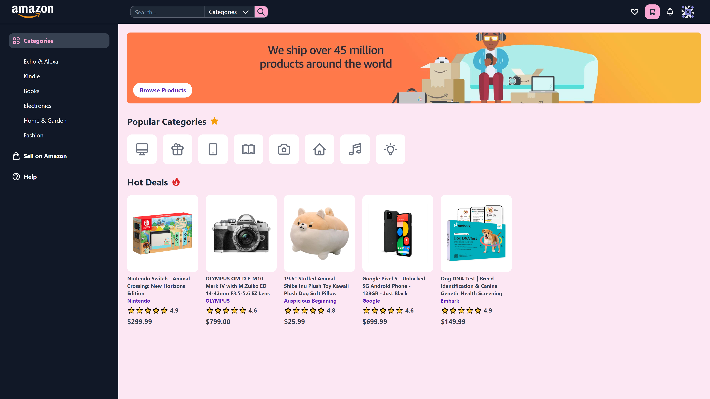

# [Amazon 2.0](https://amazon2.anniew.xyz/)

This is a redesigned Amazon clone built with HTML, Tailwind CSS, and JavaScript.

_Inspired by this concept design on [Dribbble](https://dribbble.com/shots/15350650-Amazon-Website-Redesign-Concept)._

**LIVE DEMO** - [amazon.anniew.xyz](https://amazon2.anniew.xyz/) OR [annie-amazon2.netlify.app](https://annie-amazon2.netlify.app/)

    
    
    
    

    

## Built With

- [HTML5](https://www.w3schools.com/html/)
- [CSS3](https://www.w3schools.com/css/)
- [Tailwind CSS](https://tailwindcss.com/)
- [JavaScript](https://www.w3schools.com/js/DEFAULT.asp)
- [Heroicons](https://heroicons.com/) for the icons
- Hosted on [Firebase](https://firebase.google.com/docs/hosting/quickstart)

---

## Creator / Maintainer

Annie Wu ([anniedotexe](https://github.com/anniedotexe))

If you have any questions about the code, feel free to contact me anywhere below.

  
  
  
  

This project was created for educational purposes and for personal and open-source use.

If you like my content or find this code useful, give it a :star: or support me by buying me a coffee :coffee::heart:

---

## Acknowledgments

- [CleverProgrammer](https://www.cleverprogrammer.com/) for their Building Amazon 2.0 tutorial
  - [Part 1](https://www.youtube.com/watch?v=HkTXe-O1ArM)
  - [Part 2 - Cart Page](https://www.youtube.com/watch?v=lfxzyE5Gs84)
  - [Part 3]()
