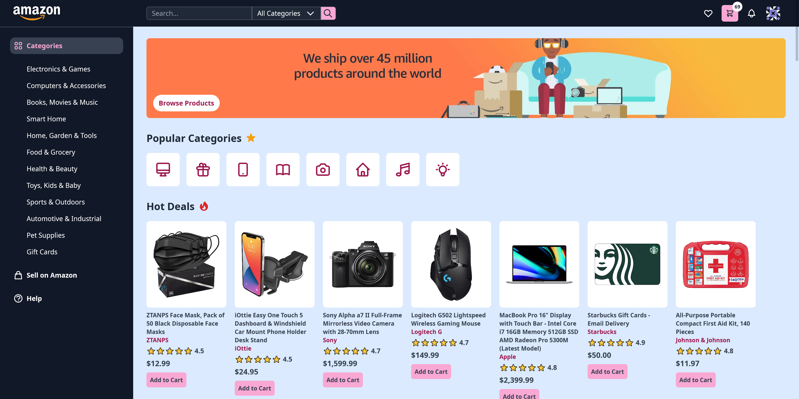

# [Amazon 2.0](https://clone-2-2ee81.firebaseapp.com/)

This is a redesigned Amazon clone built with HTML, Tailwind CSS, and JavaScript. It uses the Firestore Database and is hosted on Firebase.

_Inspired by this concept design on [Dribbble](https://dribbble.com/shots/15350650-Amazon-Website-Redesign-Concept)._

It is currently not responsive. Please view it on desktop.

The Firebase init files are not pushed to the repository, so private information does not get leaked.

If the items are not showing on Chrome, try a different browser.

**LIVE DEMO** - [clone-2-2ee81.firebaseapp.com](https://clone-2-2ee81.firebaseapp.com/)

    
    
    
    
    

    

## Features

- Click the logo and shopping icon to switch between the home page and cart
- Add items to cart
- Increase / Decrease quantity of items in cart
- Delete item from cart

## Built With

- [HTML5](https://www.w3schools.com/html/)
- [CSS3](https://www.w3schools.com/css/)
- [Tailwind CSS](https://tailwindcss.com/)
- [JavaScript](https://www.w3schools.com/js/DEFAULT.asp)
- [Heroicons](https://heroicons.com/) for the icons
- [Firestore Database](https://firebase.google.com/docs/firestore)
- Hosted on [Firebase](https://firebase.google.com/docs/hosting/quickstart)

---

## Contributing

Pull requests are welcome. For major changes, please open an issue first to discuss what you would like to change. Please make sure to update tests as appropriate.

### How To Contribute

1. Fork the repository to your own Github account.
2. Clone the project to your machine.
3. Create a branch locally with a succinct but descriptive name.
4. Commit changes to the branch.
5. Following any formatting and testing guidelines specific to this repo.
6. Push changes to your fork.
7. Open a Pull Request in my repository.

---

## Creator / Maintainer

Annie Wu ([anniedotexe](https://github.com/anniedotexe))

If you have any questions, comments, or concerns, feel free to contact me below.

  

This project was created for educational purposes and for personal and open-source use.

If you like my content or find this code useful, give it a :star: or support me by buying me a coffee :coffee::heart:

---

## Acknowledgments

- [CleverProgrammer](https://www.cleverprogrammer.com/) for their Building Amazon 2.0 tutorial
  - [Part 1 - Home Page](https://www.youtube.com/watch?v=HkTXe-O1ArM)
  - [Part 2 - Cart Page](https://www.youtube.com/watch?v=lfxzyE5Gs84)
  - [Part 3 - Firebase and Firestore Database](https://www.youtube.com/watch?v=FkqZfGEav9c)
